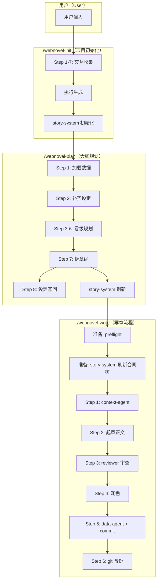
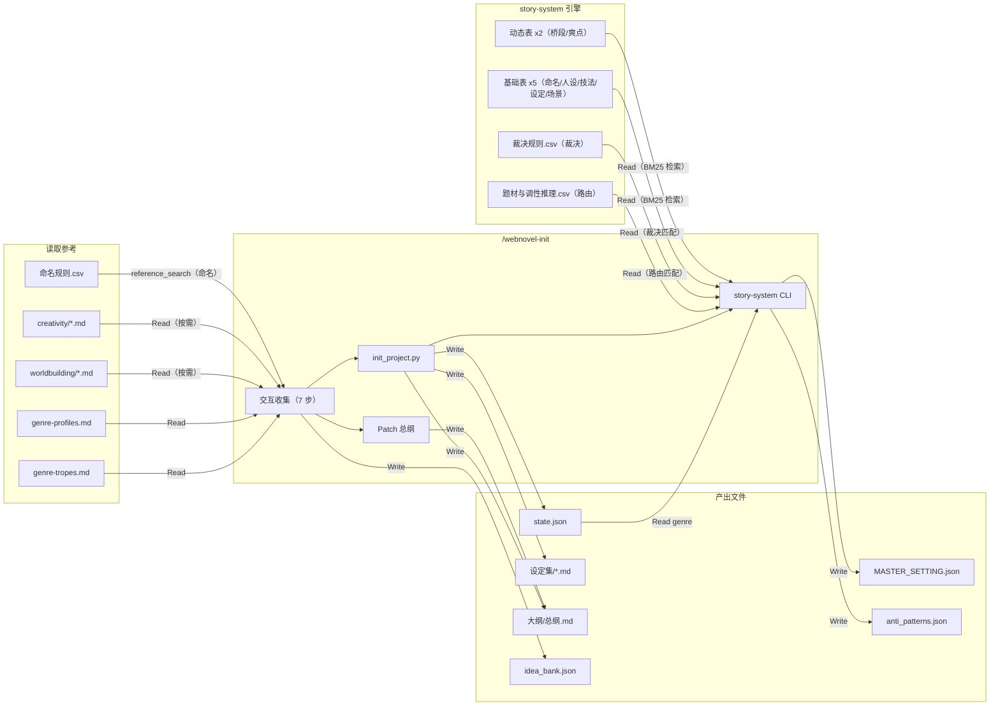
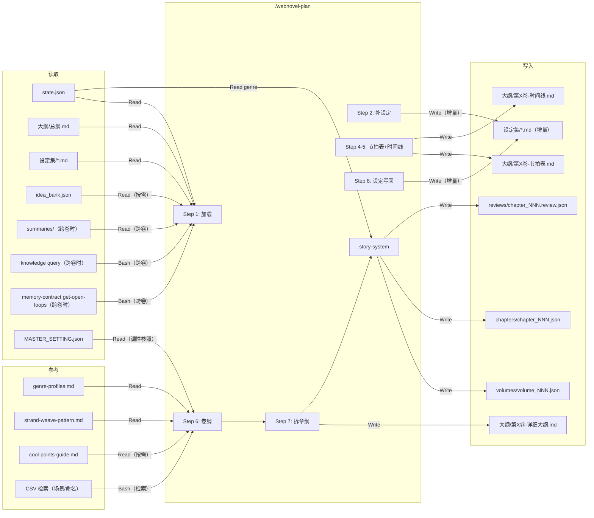
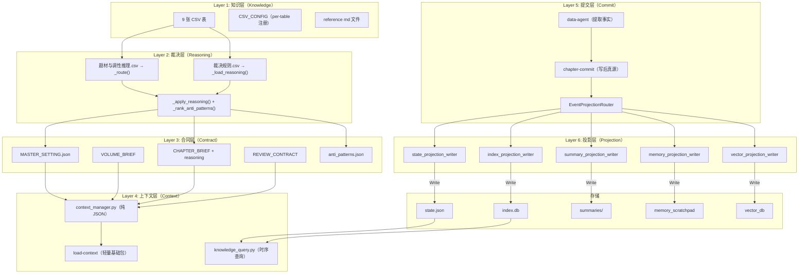
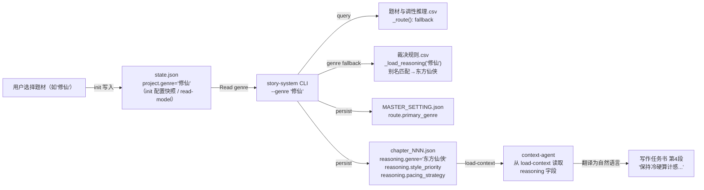

# Webnovel Writer 系统架构图

> 生成日期：2026-04-15
> 覆盖范围：init → plan → write 全链路的读写关系

## 总链路

```mermaid
graph TB
    subgraph USER["用户（User）"]
        U_INPUT["用户输入"]
    end

    subgraph INIT["/webnovel-init（项目初始化）"]
        INIT_COLLECT["Step 1-7: 交互收集"]
        INIT_GEN["执行生成"]
        INIT_STORY["story-system 初始化"]
    end

    subgraph PLAN["/webnovel-plan（大纲规划）"]
        PLAN_LOAD["Step 1: 加载数据"]
        PLAN_SETTING["Step 2: 补齐设定"]
        PLAN_VOLUME["Step 3-6: 卷级规划"]
        PLAN_CHAPTER["Step 7: 拆章纲"]
        PLAN_WRITEBACK["Step 8: 设定写回"]
        PLAN_STORY["story-system 刷新"]
    end

    subgraph WRITE["/webnovel-write（写章流程）"]
        W_PREFLIGHT["准备: preflight"]
        W_STORY["准备: story-system 刷新合同树"]
        W_STEP1["Step 1: context-agent"]
        W_STEP2["Step 2: 起草正文"]
        W_STEP3["Step 3: reviewer 审查"]
        W_STEP4["Step 4: 润色"]
        W_STEP5["Step 5: data-agent + commit"]
        W_STEP6["Step 6: git 备份"]
    end

    U_INPUT --> INIT_COLLECT
    INIT_COLLECT --> INIT_GEN --> INIT_STORY
    INIT_STORY --> PLAN_LOAD
    PLAN_LOAD --> PLAN_SETTING --> PLAN_VOLUME --> PLAN_CHAPTER --> PLAN_WRITEBACK
    PLAN_CHAPTER --> PLAN_STORY
    PLAN_STORY --> W_PREFLIGHT
    W_PREFLIGHT --> W_STORY --> W_STEP1 --> W_STEP2 --> W_STEP3 --> W_STEP4 --> W_STEP5 --> W_STEP6
```

## Init 阶段读写

```mermaid
graph LR
    subgraph INIT["/webnovel-init"]
        I1["交互收集（7 步）"]
        I2["init_project.py"]
        I3["Patch 总纲"]
        I4["story-system CLI"]
    end

    subgraph STORE_INIT["产出文件"]
        S_STATE["state.json"]
        S_SETTING["设定集/*.md"]
        S_OUTLINE["大纲/总纲.md"]
        S_IDEA["idea_bank.json"]
        S_MASTER["MASTER_SETTING.json"]
        S_ANTI["anti_patterns.json"]
    end

    subgraph REF_INIT["读取参考"]
        R_GENRE_TROPES["genre-tropes.md"]
        R_GENRE_PROFILE["genre-profiles.md"]
        R_WORLD["worldbuilding/*.md"]
        R_CREATIVE["creativity/*.md"]
        R_CSV_NAME["命名规则.csv"]
    end

    R_GENRE_TROPES -->|"Read"| I1
    R_GENRE_PROFILE -->|"Read"| I1
    R_WORLD -->|"Read（按需）"| I1
    R_CREATIVE -->|"Read（按需）"| I1
    R_CSV_NAME -->|"reference_search（命名）"| I1

    I1 --> I2
    I2 -->|"Write"| S_STATE
    I2 -->|"Write"| S_SETTING
    I2 -->|"Write"| S_OUTLINE
    I1 --> I3
    I3 -->|"Write"| S_OUTLINE
    I1 -->|"Write"| S_IDEA

    I2 --> I4
    S_STATE -->|"Read genre"| I4
    I4 -->|"Write"| S_MASTER
    I4 -->|"Write"| S_ANTI

    subgraph CSV_ENGINE["story-system 引擎"]
        CSV_ROUTE["题材与调性推理.csv（路由）"]
        CSV_REASON["裁决规则.csv（裁决）"]
        CSV_BASE["基础表 x5（命名/人设/技法/设定/场景）"]
        CSV_DYN["动态表 x2（桥段/爽点）"]
    end

    CSV_ROUTE -->|"Read（路由匹配）"| I4
    CSV_REASON -->|"Read（裁决匹配）"| I4
    CSV_BASE -->|"Read（BM25 检索）"| I4
    CSV_DYN -->|"Read（BM25 检索）"| I4
```

## Plan 阶段读写

```mermaid
graph LR
    subgraph PLAN["/webnovel-plan"]
        P1["Step 1: 加载"]
        P2["Step 2: 补设定"]
        P3["Step 4-5: 节拍表+时间线"]
        P4["Step 6: 卷纲"]
        P5["Step 7: 拆章纲"]
        P6["Step 8: 设定写回"]
        P7["story-system"]
    end

    subgraph READ_PLAN["读取"]
        R_STATE2["state.json"]
        R_OUTLINE2["大纲/总纲.md"]
        R_SETTING2["设定集/*.md"]
        R_IDEA2["idea_bank.json"]
        R_SUMMARY["summaries/（跨卷时）"]
        R_KNOWLEDGE["knowledge query（跨卷时）"]
        R_LOOPS["memory-contract get-open-loops（跨卷时）"]
        R_MASTER2["MASTER_SETTING.json"]
    end

    subgraph WRITE_PLAN["写入"]
        W_BEAT["大纲/第X卷-节拍表.md"]
        W_TIMELINE["大纲/第X卷-时间线.md"]
        W_DETAIL["大纲/第X卷-详细大纲.md"]
        W_SETTING2["设定集/*.md（增量）"]
        W_VOLUME["volumes/volume_NNN.json"]
        W_CHAP_CONTRACT["chapters/chapter_NNN.json"]
        W_REVIEW_CONTRACT["reviews/chapter_NNN.review.json"]
    end

    subgraph REF_PLAN["参考"]
        R_GP["genre-profiles.md"]
        R_STRAND["strand-weave-pattern.md"]
        R_COOL["cool-points-guide.md"]
        R_CSV_PLAN["CSV 检索（场景/命名）"]
    end

    R_STATE2 -->|"Read"| P1
    R_OUTLINE2 -->|"Read"| P1
    R_SETTING2 -->|"Read"| P1
    R_IDEA2 -->|"Read（按需）"| P1
    R_SUMMARY -->|"Read（跨卷）"| P1
    R_KNOWLEDGE -->|"Bash（跨卷）"| P1
    R_LOOPS -->|"Bash（跨卷）"| P1
    R_MASTER2 -->|"Read（调性参照）"| P4

    P2 -->|"Write（增量）"| W_SETTING2
    P3 -->|"Write"| W_BEAT
    P3 -->|"Write"| W_TIMELINE
    P4 --> P5
    P5 -->|"Write"| W_DETAIL

    R_GP -->|"Read"| P4
    R_STRAND -->|"Read"| P4
    R_COOL -->|"Read（按需）"| P4
    R_CSV_PLAN -->|"Bash（检索）"| P4

    P6 -->|"Write（增量）"| W_SETTING2

    P5 --> P7
    R_STATE2 -->|"Read genre"| P7
    P7 -->|"Write"| W_VOLUME
    P7 -->|"Write"| W_CHAP_CONTRACT
    P7 -->|"Write"| W_REVIEW_CONTRACT
```

## Write 阶段读写（核心链路）

```mermaid
graph TB
    subgraph PREP["准备阶段"]
        PRE1["preflight + where"]
        PRE2["story-system CLI"]
    end

    subgraph STEP1["Step 1: context-agent（子代理）"]
        CA_LOAD["load-context"]
        CA_READ["Read 章纲原文"]
        CA_QUERY["按需 query-entity / query-rules"]
        CA_OUT["输出: 写作任务书"]
    end

    subgraph STEP2["Step 2: 起草正文"]
        S2_WRITE["Write 正文"]
        S2_CSV["reference_search（按需）"]
    end

    subgraph STEP3["Step 3: reviewer（子代理）"]
        REV_READ["Read 正文"]
        REV_CONTRACT["Read 审查合同"]
        REV_OUT["Write review_results.json"]
        REV_PIPE["review-pipeline --save-metrics"]
    end

    subgraph STEP4["Step 4: 润色"]
        S4_REF["Read polish-guide / typesetting / style-adapter"]
        S4_EDIT["Edit 正文"]
    end

    subgraph STEP5["Step 5: data-agent + commit"]
        DA_READ["Read 正文"]
        DA_ENTITY["Bash: get-core-entities / recent-appearances"]
        DA_ARTIFACTS["Write 4份 artifacts"]
        COMMIT["chapter-commit CLI"]
        PROJ["projection writers x5"]
    end

    subgraph STEP6["Step 6: Git"]
        GIT["git add + commit"]
    end

    %% 数据存储
    subgraph STORES["数据存储"]
        ST_STATE["state.json（状态）"]
        ST_INDEX["index.db（实体/关系）"]
        ST_SUMMARY["summaries/chNNNN.md（摘要）"]
        ST_MEMORY["memory_scratchpad.json（记忆）"]
        ST_VECTOR["vector_db（向量索引）"]
        ST_COMMIT["commits/chapter_NNN.commit.json（写后真源）"]
        ST_CHAPTER["正文/第NNNN章.md"]
        ST_TMP["tmp/*.json（中间产物）"]
    end

    subgraph CONTRACTS["合同树（.story-system/）"]
        CT_MASTER["MASTER_SETTING.json"]
        CT_VOLUME["volumes/volume_NNN.json"]
        CT_CHAPTER["chapters/chapter_NNN.json"]
        CT_REVIEW["reviews/chapter_NNN.review.json"]
        CT_ANTI["anti_patterns.json"]
    end

    subgraph OUTLINE["大纲"]
        OL_DETAIL["大纲/第X卷-详细大纲.md"]
    end

    subgraph CSV["CSV 知识层"]
        CSV_R["题材与调性推理.csv（路由）"]
        CSV_J["裁决规则.csv（裁决）"]
        CSV_ALL["基础表+动态表 x7"]
    end

    subgraph REFS["润色参考"]
        REF_POLISH["polish-guide.md"]
        REF_TYPE["typesetting.md"]
        REF_STYLE["style-adapter.md"]
    end

    %% 准备阶段
    ST_STATE -->|"Read genre"| PRE2
    CSV_R -->|"Read（路由）"| PRE2
    CSV_J -->|"Read（裁决）"| PRE2
    CSV_ALL -->|"Read（BM25）"| PRE2
    PRE2 -->|"Write"| CT_MASTER
    PRE2 -->|"Write"| CT_VOLUME
    PRE2 -->|"Write"| CT_CHAPTER
    PRE2 -->|"Write"| CT_REVIEW
    PRE2 -->|"Write"| CT_ANTI

    %% Step 1
    PRE2 --> CA_LOAD
    CA_LOAD -->|"Bash: load-context"| ST_STATE
    CA_LOAD -.->|"内含 contracts"| CT_MASTER
    CA_LOAD -.->|"内含 summaries"| ST_SUMMARY
    CA_LOAD -.->|"内含 protagonist"| ST_STATE
    CA_LOAD -.->|"内含 loops"| ST_STATE
    CA_READ -->|"Read"| OL_DETAIL
    CA_QUERY -->|"Bash（按需）"| ST_INDEX
    CA_OUT -->|"输出任务书"| STEP2

    %% Step 2
    S2_CSV -->|"Bash: reference_search"| CSV_ALL
    S2_WRITE -->|"Write"| ST_CHAPTER

    %% Step 3
    REV_READ -->|"Read"| ST_CHAPTER
    REV_CONTRACT -->|"Read"| CT_REVIEW
    REV_OUT -->|"Write"| ST_TMP
    REV_PIPE -->|"Bash + Write index.db"| ST_INDEX

    %% Step 4
    S4_REF -->|"Read"| REF_POLISH
    S4_REF -->|"Read"| REF_TYPE
    S4_REF -->|"Read"| REF_STYLE
    S4_EDIT -->|"Edit"| ST_CHAPTER

    %% Step 5
    DA_READ -->|"Read"| ST_CHAPTER
    DA_ENTITY -->|"Bash"| ST_INDEX
    DA_ARTIFACTS -->|"Write x4"| ST_TMP
    ST_TMP -->|"Read artifacts"| COMMIT
    COMMIT -->|"Write"| ST_COMMIT

    %% Projection
    COMMIT --> PROJ
    PROJ -->|"Write state_deltas"| ST_STATE
    PROJ -->|"Write entity_deltas"| ST_INDEX
    PROJ -->|"Write summary_text"| ST_SUMMARY
    PROJ -->|"Write memory_facts"| ST_MEMORY
    PROJ -->|"Write event+delta chunks"| ST_VECTOR

    %% Step 6
    PROJ --> GIT
```

## 六层主链总览

```mermaid
graph TB
    subgraph L1["Layer 1: 知识层（Knowledge）"]
        CSV_TABLES["9 张 CSV 表"]
        CSV_CONFIG["CSV_CONFIG（per-table 注册）"]
        REF_MD["reference md 文件"]
    end

    subgraph L2["Layer 2: 裁决层（Reasoning）"]
        ROUTE["题材与调性推理.csv → _route()"]
        REASON["裁决规则.csv → _load_reasoning()"]
        APPLY["_apply_reasoning() + _rank_anti_patterns()"]
    end

    subgraph L3["Layer 3: 合同层（Contract）"]
        MASTER["MASTER_SETTING.json"]
        VOLUME["VOLUME_BRIEF"]
        CHAPTER["CHAPTER_BRIEF + reasoning"]
        REVIEW["REVIEW_CONTRACT"]
        ANTI_P["anti_patterns.json"]
    end

    subgraph L4["Layer 4: 上下文层（Context）"]
        CTX_MGR["context_manager.py（纯 JSON）"]
        LOAD_CTX["load-context（轻量基础包）"]
        KNOW_Q["knowledge_query.py（时序查询）"]
    end

    subgraph L5["Layer 5: 提交层（Commit）"]
        DA["data-agent（提取事实）"]
        COMMIT_SVC["chapter-commit（写后真源）"]
        PROJ_ROUTER["EventProjectionRouter"]
    end

    subgraph L6["Layer 6: 投影层（Projection）"]
        PW_STATE["state_projection_writer"]
        PW_INDEX["index_projection_writer"]
        PW_SUMMARY["summary_projection_writer"]
        PW_MEMORY["memory_projection_writer"]
        PW_VECTOR["vector_projection_writer"]
    end

    subgraph STORES["存储"]
        S_STATE["state.json"]
        S_INDEX["index.db"]
        S_SUMMARY["summaries/"]
        S_MEMORY["memory_scratchpad"]
        S_VECTOR["vector_db"]
    end

    CSV_TABLES --> ROUTE
    CSV_TABLES --> REASON
    ROUTE --> APPLY
    REASON --> APPLY
    APPLY --> MASTER
    APPLY --> CHAPTER
    APPLY --> ANTI_P

    MASTER --> CTX_MGR
    VOLUME --> CTX_MGR
    CHAPTER --> CTX_MGR
    REVIEW --> CTX_MGR
    CTX_MGR --> LOAD_CTX

    S_STATE --> KNOW_Q
    S_INDEX --> KNOW_Q

    DA --> COMMIT_SVC
    COMMIT_SVC --> PROJ_ROUTER

    PROJ_ROUTER --> PW_STATE
    PROJ_ROUTER --> PW_INDEX
    PROJ_ROUTER --> PW_SUMMARY
    PROJ_ROUTER --> PW_MEMORY
    PROJ_ROUTER --> PW_VECTOR

    PW_STATE -->|"Write"| S_STATE
    PW_INDEX -->|"Write"| S_INDEX
    PW_SUMMARY -->|"Write"| S_SUMMARY
    PW_MEMORY -->|"Write"| S_MEMORY
    PW_VECTOR -->|"Write"| S_VECTOR
```

## 题材流通路径

```mermaid
graph LR
    INIT_USER["用户选择题材（如'修仙'）"]
    STATE_GENRE["state.json<br/>project.genre='修仙'<br/>（init 配置快照 / read-model）"]
    
    STORY_CLI["story-system CLI<br/>--genre '修仙'"]
    
    ROUTE_TABLE["题材与调性推理.csv<br/>_route(): fallback"]
    REASON_TABLE["裁决规则.csv<br/>_load_reasoning('修仙')<br/>别名匹配→东方仙侠"]
    
    MASTER_OUT["MASTER_SETTING.json<br/>route.primary_genre"]
    CHAPTER_OUT["chapter_NNN.json<br/>reasoning.genre='东方仙侠'<br/>reasoning.style_priority<br/>reasoning.pacing_strategy"]
    
    CTX_AGENT["context-agent<br/>从 load-context 读取<br/>reasoning 字段"]
    
    BRIEF["写作任务书 第4段<br/>'保持冷硬算计感...'"]

    INIT_USER -->|"init 写入"| STATE_GENRE
    STATE_GENRE -->|"Read genre"| STORY_CLI
    STORY_CLI -->|"query"| ROUTE_TABLE
    STORY_CLI -->|"genre fallback"| REASON_TABLE
    STORY_CLI -->|"persist"| MASTER_OUT
    STORY_CLI -->|"persist"| CHAPTER_OUT
    CHAPTER_OUT -->|"load-context"| CTX_AGENT
    CTX_AGENT -->|"翻译为自然语言"| BRIEF
```
